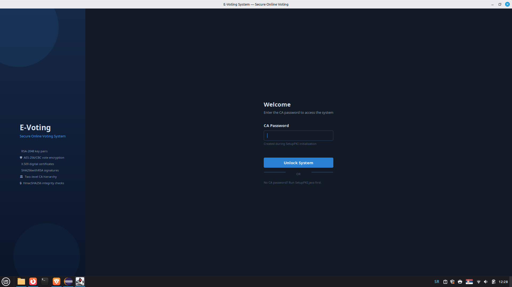
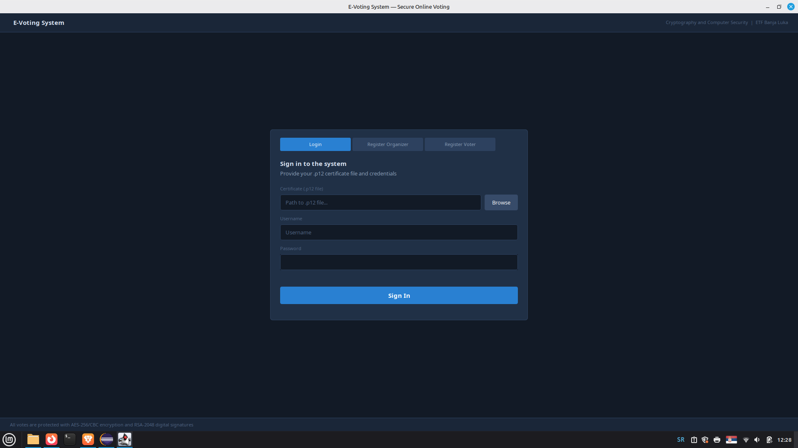
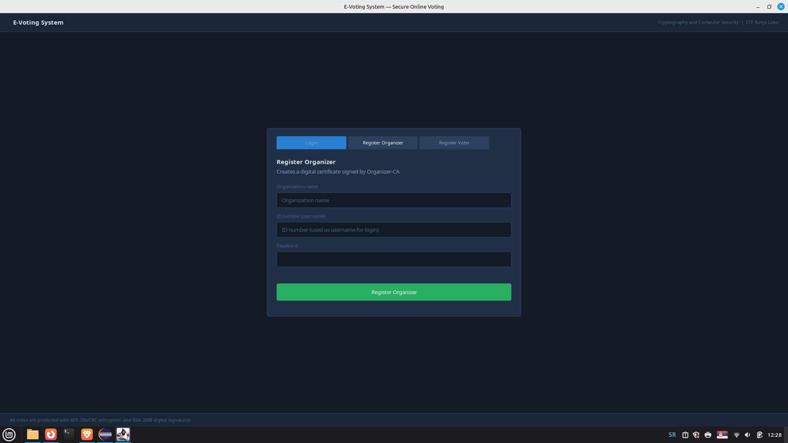
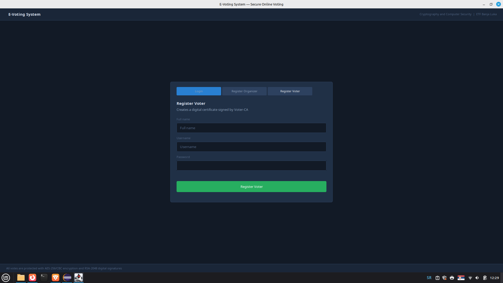
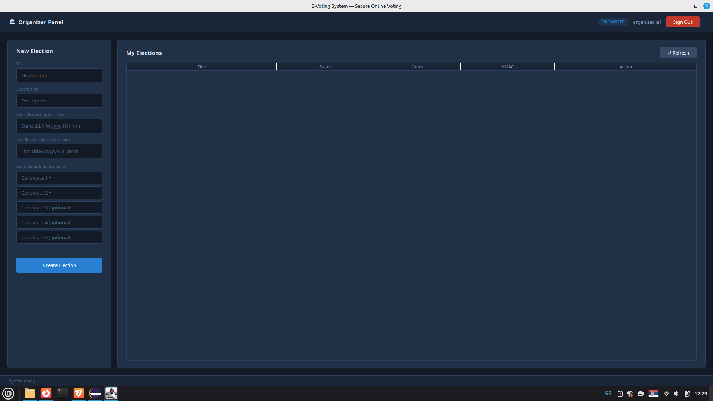
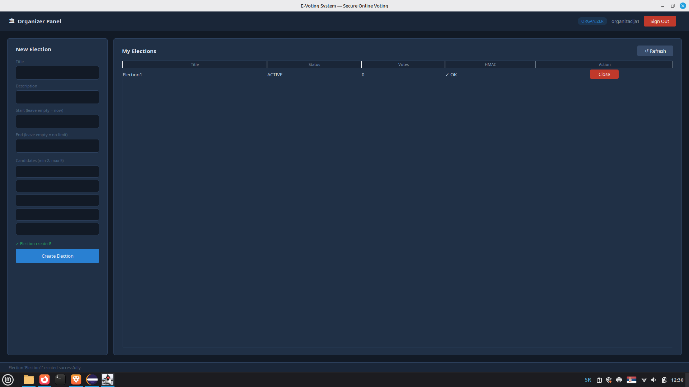
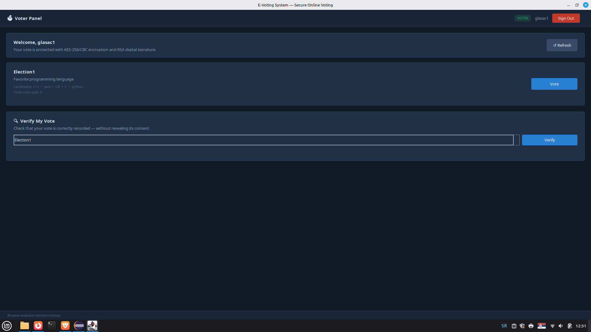
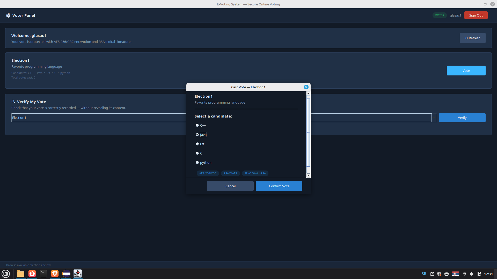
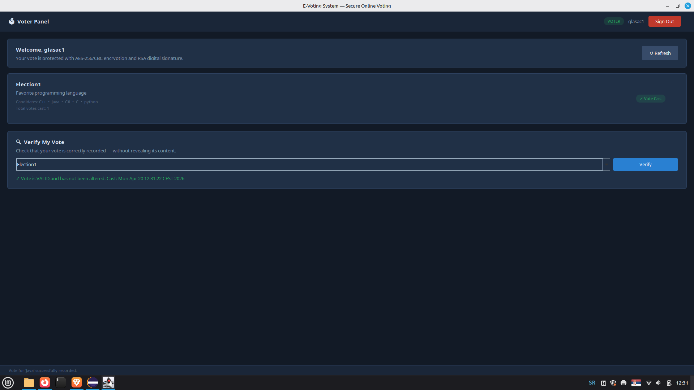
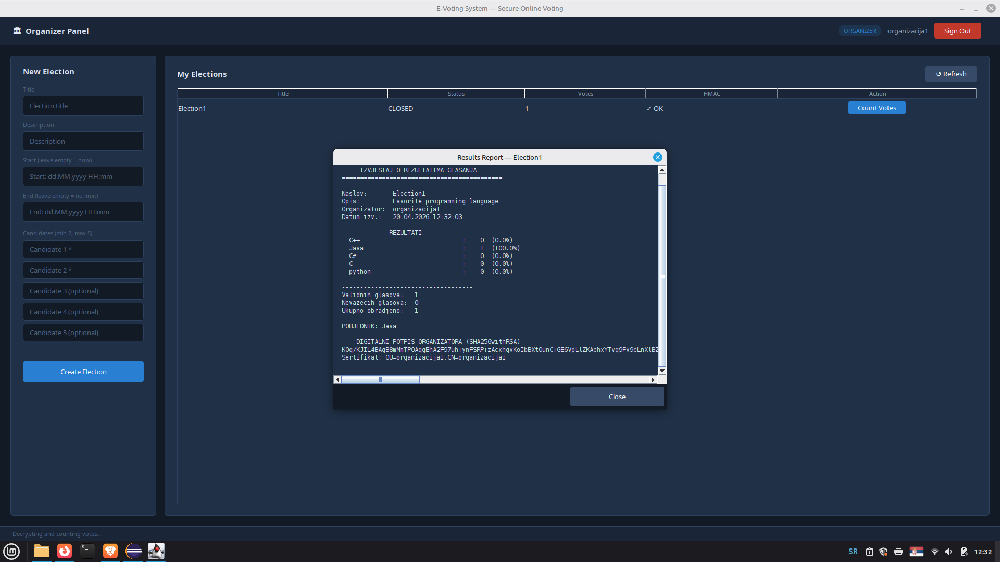

# E-Voting System — Secure Online Voting

A desktop application that simulates a secure multi-user e-voting system, built as a university project for the **Cryptography and Computer Security** course at the Faculty of Electrical Engineering, Banja Luka.

The system guarantees **authenticity**, **confidentiality**, and **integrity** of all data using industry-standard cryptographic primitives.

---

## Table of Contents

- [Features](#features)
- [Cryptographic Architecture](#cryptographic-architecture)
- [Project Structure](#project-structure)
- [Prerequisites](#prerequisites)
- [Getting Started](#getting-started)
- [Usage Guide](#usage-guide)
- [Security Implementation Details](#security-implementation-details)
- [File System Layout](#file-system-layout)
- [Class Reference](#class-reference)

---

## Features

- **Two-tier PKI hierarchy** — Root CA → Organizer CA + Voter CA
- **X.509 digital certificates** with appropriate KeyUsage extensions per role
- **Two-step login** — certificate validation + password verification
- **Hybrid vote encryption** — AES-256/CBC per vote + RSA/OAEP key wrapping
- **Digital signatures** — SHA256withRSA on every cast vote
- **Vote verification** — voters can verify their vote without revealing its content
- **HMAC integrity protection** on election metadata (HmacSHA256)
- **CRL support** — separate revocation list per CA, automatic revocation after 3 failed logins
- **Digitally signed results report** — generated and signed by the organizer after counting
- **Java Swing GUI** — dark-themed professional interface

---

## Cryptographic Architecture

### PKI Hierarchy

```
Root CA  (root_ca.p12)
   ├── Organizer-CA  (organizer_ca.p12)  — issues certificates to organizers only
   └── Voter-CA      (voter_ca.p12)      — issues certificates to voters only
```

### Vote Encryption Flow (Hybrid Encryption)

```
VOTING:
─────────────────────────────────────────────────────────────
  Step 1: Generate random AES-256 key          (unique per vote)
  Step 2: Encrypt candidate name               AES/CBC/PKCS5Padding + random IV
  Step 3: Encrypt AES key with organizer's     RSA/ECB/OAEPWithSHA-256AndMGF1Padding
          public key
  Step 4: Sign [IV || ciphertext] with         SHA256withRSA + voter's private key
          voter's private key

COUNTING:
─────────────────────────────────────────────────────────────
  Step 1: Verify voter's signature             SHA256withRSA + voter's public key (from cert)
  Step 2: Decrypt AES key                      RSA/OAEP + organizer's private key
  Step 3: Decrypt vote                         AES/CBC + recovered key + IV
  Step 4: Sign results report                  SHA256withRSA + organizer's private key
```

### Certificate Extensions

| Role | KeyUsage | ExtendedKeyUsage |
|------|----------|-----------------|
| Organizer | `digitalSignature \| keyEncipherment` | `id_kp_emailProtection` |
| Voter | `digitalSignature \| nonRepudiation` | `id_kp_clientAuth` |

### Data Integrity

Election metadata is protected with **HmacSHA256**. The HMAC covers: title, description, start date, end date, candidate list, and organizer username. Any tampering with the `.dat` file will be detected on next load.

---

## Project Structure

```
src/
├── gui/                          # Java Swing GUI (optional, replaces MainMenu)
│   ├── AppGUI.java               # Main JFrame, color palette, screen navigation
│   ├── UIComponents.java         # Reusable styled components (buttons, fields, cards)
│   ├── StartupScreen.java        # CA password unlock screen
│   ├── MainScreen.java           # Login + Registration (tabbed)
│   ├── OrganizerScreen.java      # Election management, vote counting, reports
│   └── VoterScreen.java          # Active elections, voting dialog, verification
│
├── main/
│   ├── MainMenu.java             # Console-based main menu (alternative entry point)
│   └── VoterPanel.java           # Console voter panel
│
├── model/
│   ├── Election.java             # Election metadata model (NO plaintext votes)
│   └── EncryptedVote.java        # Encrypted vote model with timestamp
│
├── user/
│   └── UserRegistration.java     # Certificate generation and user registration
│
└── utility/
    ├── SetupPKI.java             # One-time PKI hierarchy initialization
    ├── LoginManager.java         # Two-step login, failed attempt tracking
    ├── CRLManager.java           # Certificate revocation lists (two separate files)
    ├── ElectionManager.java      # Election persistence with HMAC verification
    ├── VoteEncryptionService.java # Core crypto: encrypt, sign, verify, decrypt
    ├── VoteStorageManager.java   # Encrypted vote file storage (separate from metadata)
    ├── HMACService.java          # HmacSHA256 for metadata integrity
    ├── ReportService.java        # Vote counting and signed report generation
    ├── KeyUtils.java             # RSA key pair generation
    ├── KeyStoreManager.java      # PKCS#12 keystore load/save
    ├── RootCACreator.java        # Root CA certificate builder
    └── IntermediateCACreator.java# Intermediate CA certificate builder
```

---

## Prerequisites

- **Java 11+** (tested on Java 21)
- **Bouncy Castle** cryptography library (`bcprov-jdk18on-*.jar`)
  - Download from: https://www.bouncycastle.org/latest_releases.html
  - Add to project build path in Eclipse: `Project → Properties → Java Build Path → Add External JARs`

---

## Getting Started

### Step 1 — Initialize the PKI Hierarchy (run once)

Run `SetupPKI.java` as a Java Application.

```
[1/3] Creating Root CA...         OK  →  root_ca.p12
[2/3] Creating Organizer CA...    OK  →  organizer_ca.p12
[3/3] Creating Voter CA...        OK  →  voter_ca.p12

PKI HIERARCHY SUCCESSFULLY CREATED!
Save the CA password in a safe place.
```

> ⚠️ This must be run **once only**. Re-running it overwrites the CA keystores and invalidates all previously issued certificates.

### Step 2 — Launch the Application

**GUI mode** (recommended): Run `AppGUI.java`

**Console mode** (alternative): Run `MainMenu.java`

### Step 3 — Enter CA Password

When prompted, enter the **same password** used during `SetupPKI`. This password protects the CA keystores and is required to register new users.

---

## Usage Guide

### Registering an Organizer

1. Select **Register Organizer**
2. Enter: organization name, ID number (used as username), password
3. System creates `<id>.p12` (private key + certificate, password-protected)
4. System exports `public_certs/<id>.cer` (public certificate, readable by all)

### Registering a Voter

1. Select **Register Voter**
2. Enter: full name, username, password
3. System creates `<username>.p12` and `public_certs/<username>.cer`

### Logging In

1. Provide path to your `.p12` file (or use the **Browse** button in GUI)
2. Enter username and password
3. The system performs **4 certificate validations**:
   - ✓ Temporal validity (`checkValidity`)
   - ✓ Issuer check (must be Organizer-CA or Voter-CA)
   - ✓ CRL check (certificate not revoked)
   - ✓ Private key access (confirms password)
4. On success, the system routes to the appropriate panel based on certificate issuer

> After **3 failed login attempts**, the certificate is automatically added to the CRL and all future logins with that certificate are permanently rejected.

### Creating an Election (Organizer)

1. Enter title, description, optional start/end dates
2. Add 2–5 candidates
3. Click **Create Election** — metadata is saved with HMAC protection

### Voting (Voter)

1. Select an active election
2. Choose a candidate
3. Confirm — the system executes the full cryptographic flow:

```
[1/4] Generating AES-256 key and encrypting vote...   OK
[2/4] Saving encrypted vote (separate from metadata)... OK
[3/4] Updating election metadata (HMAC refresh)...     OK
[4/4] Verifying digital signature...                   OK
```

The vote content is **never stored in plaintext**. Only the organizer can decrypt it.

### Verifying Your Vote (Voter)

Select **Verify My Vote** and choose an election. The system:
- Locates your vote by SHA-256 hash of your username
- Verifies the RSA signature over the encrypted data
- Returns `VALID` or `INVALID` — **without decrypting the vote content**

### Counting Votes (Organizer)

1. Close the election (Organizer panel → election details → Close)
2. Select **Count Votes**, enter your password
3. For each vote, the system:
   - Verifies the voter's signature (rejects invalid votes)
   - Decrypts the AES key using the organizer's private key
   - Decrypts the vote content
   - Tallies the result
4. A **digitally signed report** is generated, displayed, and saved to `reports/<title>_report.txt`

---

## Security Implementation Details

### Why Hybrid Encryption?

AES is fast but requires secure key distribution. RSA solves key distribution but is slow for large data. The combination — encrypt data with AES, encrypt the AES key with RSA — is called **hybrid encryption** and is the same approach used by TLS, PGP, and Signal.

### Vote Anonymity

Voter usernames are never stored in plaintext alongside votes. The vote file is named after the **SHA-256 hash** of the username, providing partial anonymity while still allowing duplicate vote detection.

### IV (Initialization Vector)

Every vote uses a fresh random 16-byte IV for AES/CBC. This ensures that two voters selecting the same candidate produce completely different ciphertexts, preventing pattern analysis.

### Timing-Safe Comparison

HMAC verification uses `MessageDigest.isEqual()` instead of `String.equals()`. This prevents **timing attacks** where an attacker could deduce correct bytes by measuring response time differences.

### Non-Repudiation

Voter certificates have `KeyUsage: nonRepudiation`. Combined with the RSA signature on each vote, a voter cannot later deny having cast their vote.

---

## File System Layout

After running the application, the following structure is created in the working directory:

```
project-root/
├── root_ca.p12              # Root CA keystore (password-protected)
├── organizer_ca.p12         # Organizer CA keystore (password-protected)
├── voter_ca.p12             # Voter CA keystore (password-protected)
├── organizer_ca_crl.dat     # CRL for organizer certificates
├── voter_ca_crl.dat         # CRL for voter certificates
│
├── <username>.p12           # User keystore (one per registered user)
│
├── public_certs/
│   └── <username>.cer       # Public certificates in DER format (readable by all)
│
├── elections/
│   ├── <title>.dat          # Election metadata (HMAC-protected)
│   └── <title>_votes/
│       └── <hash>.vote      # One EncryptedVote per voter (binary)
│
└── reports/
    └── <title>_report.txt   # Digitally signed results report
```

---

## Class Reference

| Class | Package | Responsibility |
|-------|---------|---------------|
| `SetupPKI` | `utility` | One-time PKI initialization, interactive CA password input |
| `AppGUI` | `gui` | Application entry point (GUI mode), screen navigation |
| `MainMenu` | `main` | Application entry point (console mode) |
| `LoginManager` | `utility` | Two-step login, failed attempt counter, automatic CRL revocation |
| `UserRegistration` | `user` | RSA key generation, certificate issuance, `.p12` and `.cer` export |
| `VoteEncryptionService` | `utility` | `encryptAndSign()`, `verifyVoteSignature()`, `decryptVote()`, `hashUsername()` |
| `VoteStorageManager` | `utility` | Save/load/find/count encrypted vote files |
| `ElectionManager` | `utility` | Save/load elections with automatic HMAC generation and verification |
| `HMACService` | `utility` | `generateHMAC()`, `verifyHMAC()`, `deriveElectionHMACKey()` |
| `ReportService` | `utility` | Decrypt all votes, tally results, generate and sign report |
| `CRLManager` | `utility` | `isRevoked()`, `revokeCertificate()`, two separate CRL files |
| `Election` | `model` | Election metadata — title, dates, candidates, voter hashes, HMAC |
| `EncryptedVote` | `model` | Encrypted vote data — ciphertext, encrypted key, signature, cert, timestamp |

---

## Dependencies

| Library | Version | Purpose |
|---------|---------|---------|
| Bouncy Castle | `bcprov-jdk18on-1.7x` | Cryptographic operations, X.509 certificate building |
| Java SE | 11+ | Core platform |
| Java Swing | Built-in | GUI framework |

---

## 🖥️ Screenshots

### Welcome Screen
> Welcome Screen to unlock the system



---

### System Unlocked
> System Unlocked Screen



---

### Register Organization Screen
> Register Organization Panel



### Register Voter Screen
> Register Voter Panel



### Organizer Panel Screen
> Organizer Panel Screen



### Election Created
> Election Created Screen



### Voter Panel
> Voter Panel



### Voting Process
> Voting Process



### Voting Verification
> Voting Verification



### Election Results Report
> Election Results Reproting Screen



*Faculty of Electrical Engineering Banja Luka — Cryptography and Computer Security, 2025/2026*
